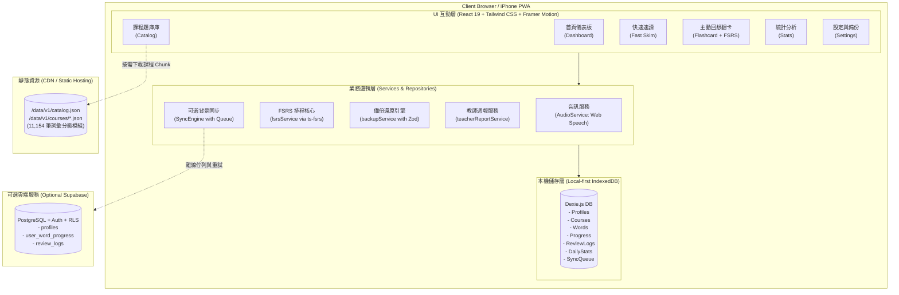

# TOEIC 速記 (TOEIC Vocab PWA) - 智慧間隔重複單字學習 App

專為 iPhone、iPad 與桌面瀏覽器打造的繁體中文 TOEIC 多益單字學習 Progressive Web App (PWA)。採用現代化 **FSRS (Free Spaced Repetition Scheduler)** 記憶演算法，具備 100% 離線可用、資料隔離、Local-first 架構與可選的雲端同步能力。

---

## 🌟 核心特色 (Key Features)

- **Local-First & 離線可用**：
  - 核心架構以 IndexedDB (`dexie.js`) 為主，任何複習評分皆即時以原子交易 (Atomic Transaction) 寫入本機，完全不依賴網路。
  - 題庫切分成獨立靜態模組 (`public/data/v1/courses/*.json`)，按需下載至本機快取，支援隨時在飛航模式下完整學習。
- **科學化 FSRS 記憶排程**：
  - 採用現代化 `ts-fsrs` 演算法（DSR 難度、穩定度、可提取度模型），精準預估 1-Again (忘記)、2-Hard (困難)、3-Good (良好)、4-Easy (簡單) 的下次複習時間。
  - 提供即時間隔預覽（如 `< 1 分鐘`、`1 天`、`3 天`、`6 天`），評分前卡片鎖定避免誤觸。
- **雙核心學習模式**：
  - **快速速讀 (Fast Skim)**：3~10 秒自動計時換卡、例句與發音、背景分頁防暴衝暫停機制。
  - **主動回想 (Flashcard Review)**：3D 翻轉卡片、詞性釋義、商務情境例句、多益關鍵解題技巧、鍵盤快捷鍵（1-4 評分、Space 翻面）。
- **多學生資料獨立隔離**：
  - 單一裝置支援建立多位本機學生（UUID 獨立隔離），家庭共用或教師出借設備時紀錄互不干擾。
- **音訊彈性降級 (Web Speech API)**：
  - 首次學習手勢解鎖 iOS Safari Web Audio；優先播放遠端音訊，失敗時自動無縫退回 Web Speech API 合成語音。
- **隱私安全教師進度回報**：
  - 學生可於設定頁一鍵產生學習週報（包含完成字數、良好率、專注時長與 Top 15 常忘單字），不洩漏任何私人帳號或敏感資訊。
- **完整備份與遷移**：
  - 支援一鍵匯出版本化 JSON 備份檔案，並具備 Zod 格式驗證與「合併 (Merge) / 取代 (Replace)」還原策略。

---

## 🏗️ 系統架構圖 (Architecture Diagram)



---

## 🚀 快速開始與本機開發 (Getting Started)

### 1. 系統需求
- Node.js 20 或 22+ LTS
- npm 10+

### 2. 安裝依賴
```bash
npm install
```

### 3. 下載與清洗資料集 (ETL Pipeline)
本專案已內建完整的 Hugging Face dataset ETL 下載與清洗工具：
```bash
# 1. 從 Hugging Face 下載最新 11,000+ 詞彙資料
npm run data:download

# 2. 執行清洗、Unicode 正規化、去重、FSRS 分級模組與 QA 報告產出
npm run data:build
```
> 若在無網路環境或想自訂 JSON 資料，可使用本機檔案：
> `node scripts/download-dataset.mjs --input <path-to-json>`

### 4. 啟動本機開發伺服器
```bash
npm run dev
```
瀏覽器開啟：`http://localhost:5173`

---

## 🧪 測試與品質檢查 (Testing & Quality Assurance)

```bash
# 執行全部單元測試與整合測試 (Vitest)
npm run test

# 執行 TypeScript 嚴格型別檢查
npm run typecheck

# 執行 ESLint 靜態代碼檢查 (0 warnings 限制)
npm run lint

# Production 建置驗證
npm run build
```

---

## 📦 部署指南 (Deployment)

### Local-Only 模式（預設）
本專案為純靜態 SPA + PWA 架構，建置後產生的 `dist/` 目錄可直接部署至任何靜態託管平台：

#### 1. Vercel
```bash
npm install -g vercel
vercel --prod
```

#### 2. Cloudflare Pages
- 建立新專案，連接 Git Repository
- Build Command: `npm run build`
- Build Output Directory: `dist`

#### 3. GitHub Pages
在 `vite.config.ts` 中若部署至子路徑（如 `https://<user>.github.io/<repo>/`），請設定 `base: '/<repo>/'`。

---

## ☁️ 可選雲端同步配置 (Optional Supabase Cloud Sync)

若需要跨裝置同步，可啟用 Supabase 後端：

1. 在 [Supabase](https://supabase.com) 建立專案。
2. 進入 SQL Editor，執行專案中的資料庫遷移腳本：
   `supabase/migrations/0001_initial.sql`
   *(已包含完整 RLS 權限與 auth.uid() 限制)*。
3. 複製 `.env.example` 為 `.env` 並填入金鑰：
   ```env
   VITE_ENABLE_CLOUD_SYNC=true
   VITE_SUPABASE_URL=https://your-project.supabase.co
   VITE_SUPABASE_ANON_KEY=your-anon-key
   ```
4. 重新建置 `npm run build`，App 將自動啟用雲端同步引擎。

---

## 📱 iPhone 實機驗收與安裝清單 (iPhone PWA Acceptance)

| 測試項目 | 驗收步驟 | 預期結果 |
| :--- | :--- | :--- |
| **1. Safari 安裝至主畫面** | 以 Safari 開啟網址，點擊「分享」→「加入主畫面」。 | 主畫面出現 App 圖示，點擊後以全螢幕 Standalone 模式啟動（無 Safari 網址列）。 |
| **2. 音訊首次手勢解鎖** | 進入「快速速讀」或「主動回想」，點擊「開始」按鈕。 | 手勢成功解鎖 AudioContext，單字能正常發音，切卡時上一段發音立即中斷。 |
| **3. 離線斷網測試** | 下載任一課程後，手機開啟「飛航模式」。 | 重新開啟 App 仍可順暢速讀、翻卡並評分，紀錄正常寫入本機 IndexedDB。 |
| **4. 進度重啟保存** | 評分數張卡片後，滑掉關閉 PWA 並重新開啟。 | 儀表板正確顯示今日已複習數量與連續天數，進度未遺失。 |
| **5. 多學生本機隔離** | 在「設定」中建立「學生 A」與「學生 B」並切換。 | 學生 A 的複習進度與收藏不會出現在學生 B 的畫面上。 |
| **6. 安全區適配** | 於具備 Dynamic Island 或 Home Indicator 的 iPhone 上測試。 | 頂部標題列與底部評分按鈕均安全避開 Safe Area Inset，無任何遮擋。 |
| **7. 備份還原測試** | 於設定頁點擊「匯出備份」，並於新學生身分點擊「匯入備份」。 | 成功讀取 JSON 備份檔，選擇「合併」後成功恢復歷史進度。 |

---

## 📄 第三方資料集與授權聲明 (Attribution & Licenses)

- **單字資料集**：`kknono668/toeic-vocab-tw` 採用 [CC BY-SA 4.0](https://creativecommons.org/licenses/by-sa/4.0/) 授權。
- **FSRS 演算法**：`ts-fsrs` 採用 MIT License。
- **IndexedDB 封裝**：`dexie.js` 採用 Apache License 2.0。
- **免責聲明**：TOEIC® 為 ETS 之註冊商標，本專案為開源學習工具，非由 ETS 官方贊助或認可。
- 詳細第三方說明請參閱工作區內之 [`THIRD_PARTY_NOTICES.md`](file:///c:/Users/hands/Downloads/多益單字gemini/THIRD_PARTY_NOTICES.md)。
