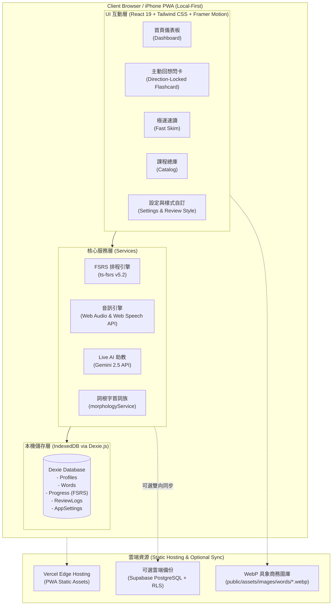

# TOEIC 速記 (TOEIC Vocab PWA) - 具象商務情境圖解 · FSRS 智慧間隔重複學習系統

專為 iPhone、iPad、Android 與桌面瀏覽器打造的現代化多益（TOEIC）單字學習 Progressive Web App (PWA)。結合 **Google Imagen 3 具象商務情境插畫**、**FSRS (Free Spaced Repetition Scheduler) 記憶排程**、**雙軌手勢互動引擎** 與 **即時 Live AI 多益教練**，具備 100% 離線可用與 Local-first 架構。

---

## 🌟 核心特色 (Key Innovations)

### 1. 📸 具象商務情境圖解 (Bespoke Scenario Art)
- **非泛用圖庫，真題考點情境量身定做**：採用 Google Imagen 3 與 Gemini 2.5 Flash 生成 1:1 正方形數位概念藝術插畫。
- **商務場景沉浸**：單字直接融入跨國商務談判、半導體晶圓無塵室、航運港口調度、航空地勤檢修、ESG 永續能源等真實多益高頻出題情境。
- **WebP 極致輕量化**：每張圖檔經智慧無失真 WebP 轉碼，體積壓縮至 ~150KB，兼具超高解析度與行動裝置極速載入。

### 2. 🧠 現代化科學記憶排程 (FSRS v4.5 Algorithm)
- **超越傳統 Anki SM-2**：採用現代化 DSR（難度 Difficulty、穩定度 Stability、可提取度 Retrievability）記憶模型，有效減少 30% 以上的重複刷題時間。
- **四段精準評分**：提供 `Again (忘記)`、`Hard (不熟)`、`Good (掌握)`、`Easy (簡單)`，卡片翻面即時預覽下次複習間隔（例如 `< 1分`、`1天`、`3天`、`7天`）。

### 3. 🎴 雙軌手勢互動引擎 & 慣用手人體工學 (v1.3.3 Innovations)
- **正面純淨主動回想 (Active Recall)**：
  - 正面僅呈現單字、發音與情境插圖，點擊卡片任何位置立即翻面，專注於大腦自我回想，消除誤導性操作。
- **A+B 雙區域融合手勢 (Dual-Zone Hybrid Gestures)**：
  - ⚡ **上方 35% 快速刷卡區**：極敏銳觸發（僅需 45px / 220px/s 輕彈），手感俐落無阻，隨心刷卡切換。
  - 📖 **下方 65% 內容閱讀區**：配備首動意圖鎖定（Direction Intent Lock），縱向滾動看長例句 100% 絕不誤觸跳題；水平長滑（70px）或快速拂動立即結題。
- **🖐️/✋ 慣用手人體工學與拇指弧度補償 (Handedness Ergonomics)**：
  - **拇指橈骨弧線補償 (Thumb Arc Angle)**：依據人體單手持機自然握法，左手模式對左下收縮弧線放寬角度判定（0.85x 容錯），拇指微向下斜切依然精準判定為「掌握」。
  - **黃金觸控區鏡像 (Thumb Zone Layout)**：左手模式將點擊頻率最高的 `💡 掌握` 置於左下角零伸展區，右手模式即時鏡像，單手通勤刷卡毫無負擔。
- **雙操作模式自由切換**：
  - 🎴 **滑動刷卡模式 (Swipe)**：支援手勢飛馳與底部大按鈕雙軌操作，伴隨觸覺微震動回饋。
  - 🎯 **Anki 專注按鈕模式 (Button)**：背面徹底停用水平手勢，100% 依賴底部按鈕，杜絕誤滑。

### 4. 🤖 4 大即時 Live AI 助教 (Gemini 2.5 Live Integration)
- 💡 **一鍵記憶法 (Mnemonic)**：結合諧音、詞根字首或職場趣味情境，秒解難背冷僻字。
- 📝 **Part 5 擬真即時出題 (Instant Quiz)**：現場生成多益 Part 5 單選文法考題，即時作答與詳解剖析。
- ✍️ **商務造句文法診斷 (Sentence Coach)**：輸入你的英文造句，AI 立即評分、修正文法，並提供道地商務潤飾建議。
- 🔍 **近義詞微語感辨析 (Nuance Compare)**：輸入混淆字，AI 以 30 秒快速圖表說明使用場合與細微差異。

### 5. 📚 全量 11,154 詞彙全球大辭典 & 點擊速查 (WordQuickPeek)
- 涵蓋完整多益 5 大分級庫（Core 1200、Advanced 2500、Expert High Part 1/2/3）。
- 例句中每個英文單字皆可點擊（Clickable Sentence），立即彈出速查卡，衍生字族（Word Family）無縫鏈結。

### 6. 📱 iPhone PWA 專屬優化 & Local-First 本機優先
- **獨立 App 沉浸體驗**：加入 iPhone 主畫面後，以全螢幕 Standalone 啟動，無網址列干擾。
- **底欄外觀與像素級微調**：支援經典底欄、平貼底邊、Apple Music 懸浮島嶼膠囊風格，並提供 -30px ~ +30px 像素微調滑桿。
- **純離線可用**：核心資料存於 IndexedDB（Dexie.js），無網路或飛航模式下所有進度正常累積。

---

## 🏗️ 系統架構圖 (System Architecture)



---

## 🚀 本機開發與建置 (Development)

### 1. 系統需求
- Node.js 20 或 22+ LTS
- npm 10+

### 2. 安裝依賴
```bash
npm install
```

### 3. 啟動本機開發伺服器
```bash
npm run dev
```
開啟瀏覽器訪問：`http://localhost:5173`

### 4. 生產環境建置
```bash
npm run build
```
Vite 將自動執行 TypeScript 型別檢查並完成 PWA Service Worker 最佳化打包。

---

## 📦 發布與部署 (Deployment)

本專案經過 Workbox PWA 快取優化，原生適配 **Vercel** 邊緣部署：
- Push 代碼至 `main` 分支後，Vercel 將自動觸發 CI/CD 建置與全球 CDN 上線。
- 若需設定自訂網域或環境變數，可於 Vercel Project Settings 中配置。

---

## 📄 授權與聲明 (Attribution & Notices)

- **單字資料集**：`kknono668/toeic-vocab-tw` 採用 [CC BY-SA 4.0](https://creativecommons.org/licenses/by-sa/4.0/) 授權。
- **FSRS 演算法**：採用 `ts-fsrs` (MIT License)。
- **商標免責聲明**：TOEIC® 為 ETS（Educational Testing Service）之註冊商標。本專案為個人開源自主學習工具，非由 ETS 官方贊助、認可或隸屬。
