# 📘 TOEIC 速記 PWA：Next-Gen 完整功能升級與免費生態系規劃全書 (Master Roadmap)

> **版本**：v2.0 Next-Gen Master Plan  
> **核心原則**：**Local-First（本機優先）**、**100% 零維運成本（Zero-Cost）**、**極致手勢體驗**、**自主掌控（Self-Hosted）**

---

## 🗺️ 全系統核心架構總覽 (System Architecture)

```mermaid
graph TD
    Root["TOEIC 速記 PWA (Next-Gen)"]
    
    Root --> M1["一、資料層與題庫引擎 (Data & ETL)"]
    M1 --> M1_1["11,154 單字 3 大頻率分級 (Core 1200 / Adv 2500 / Expert)"]
    M1 --> M1_2["每字 6 題測驗矩陣 (3 題 Part 5 MCQ + 3 題 Cloze)"]
    M1 --> M1_3["3~4 組商務例句 (繁中 + 情境) + Unsplash CDN 圖庫"]
    M1 --> M1_4["Dexie.js V2 + Supabase 0002 遷移 + 斷點續傳"]

    Root --> M2["二、UI 介面與極致手勢 (UI & Gestures)"]
    M2 --> M2_1["三態滑動手勢 (右滑 Again / 上滑 Hard / 左滑 Good)"]
    M2 --> M2_2["滑動動態微光回饋 (紅光 / 橘光 / 綠光)"]
    M2 --> M2_3["視窗防抖與固定高度 h-[calc(100dvh-130px)]"]
    M2 --> M2_4["例句點擊 Web Speech API 真人朗讀"]

    Root --> M3["三、免費 Gemini AI 智慧引擎 (1,500 次/天)"]
    M3 --> M3_1["AI 商務造句批改與高階潤飾"]
    M3 --> M3_2["多益 Part 3/4 商務對話 3 回合模擬"]
    M3 --> M3_3["易混淆單字與多益陷阱微細語意對比"]
    M3 --> M3_4["AI Vision 拍照辨識生活中多益單字"]
    M3 --> M3_5["弱點單字串聯：100 字商務 Email 生成"]

    Root --> M4["四、創意進階學習功能庫 (Gamification & Tools)"]
    M4 --> M4_1["60 秒多益極速衝刺挑戰賽 (Speed Run)"]
    M4 --> M4_2["字首字根商務構詞解構樹 (Word Roots)"]
    M4 --> M4_3["多益落點分數雷達圖與 13 大領域弱點分析"]
    M4 --> M4_4["一鍵匯出考前 100 題衝刺 PDF / 列印單字卡"]
    M4 --> M4_5["成就勳章與連續打卡系統"]

    Root --> M5["五、100% 免費第三方 API 矩陣 (Open APIs)"]
    M5 --> M5_1["Free Dictionary API (真人美音/英音 MP3)"]
    M5 --> M5_2["Datamuse API (商務高頻搭配詞 Collocations)"]
    M5 --> M5_3["DiceBear API (學生專屬向量 SVG 卡通頭像)"]
    M5 --> M5_4["瀏覽器原生 Web APIs (語音辨識 / App 桌面紅點角標)"]
```



---

## 🗄️ 第一章：資料層與題庫規格 (Data & ETL Engine)

### 1. 全字庫 3 大頻率分級（11,154 筆已全數升級）
- 🔥 **`core_1200`（多益高頻核心 1,200 字）**：涵蓋 600~750 分核心 85% 多益考點。
- 💼 **`advanced_2500`（商務進階實戰 2,500 字）**：衝刺 750~860 分金色證書關鍵字。
- 🚀 **`expert_high`（高階挑戰 7,454 字）**：高難度管理術語與商務專業詞彙。

### 2. 每單字 6 題立體測驗矩陣（全庫共 66,924 題）
- **3 題多益 Part 5 四選一選擇題 (MCQ)**：
  1. `vocab_choice`：商務語意與前後文語境選詞題。
  2. `grammar_form`：同字根詞性變化（名詞/動詞/形容詞/分詞構句）陷阱題。
  3. `synonym_context`：多益 Part 7 必備之「同義詞換句話說（Paraphrasing）」題。
- **3 題克漏字填空題 (Cloze Fill)**：
  4. `collocation_cloze`：商務高頻搭配詞填空（如 `accommodate the request`）。
  5. `active_recall`：首字母與詞性提示之主動拼寫回憶題（如 `a____ (v.) 容納/配合`）。
  6. `sentence_complete`：商務情境句意挖空填答題。
- **解析規格**：每題均附有繁體中文詳解（`explanation`），標註多益解題眼與文法陷阱。

### 3. 商務例句與免版權圖片 CDN
- 每字提供 **3~4 組商務情境例句**，標註情境標籤（如 `[商務會議]`、`[合約法律]`、`[財務審計]`、`[供應鏈物流]`、`[客戶服務]`）。
- 整合 Unsplash 官方商務高清圖庫 CDN 直連，支援離線與載入失敗零版面偏移自動摺疊。

---

## 🎴 第二章：UI 介面與極致手勢重構 (UI & Gestures)

### 1. 卡片學習頁面 (`src/pages/FlashcardPage.tsx` & `SwipeableCard.tsx`)
- **三態直覺滑動手勢**：
  - 👉 **向右滑動 (Right Swipe)**：💥 **忘記 (Again - 1)** $\rightarrow$ 縮短複習間隔，排入近期加強。
  - 👆 **向上滑動 (Up Swipe)**：🤔 **不熟 (Hard - 2)** $\rightarrow$ 輕度縮短間隔。
  - 👈 **向左滑動 (Left Swipe)**：💡 **掌握 (Good - 3)** $\rightarrow$ 正常拉長 FSRS 複習間隔。
- **拖曳動態微光回饋 (Swipe Glow)**：
  - 右拉：泛出 **紅色微光** (`border-red-500/80 shadow-red-950/40`)。
  - 左拉：泛出 **翡翠綠微光** (`border-emerald-500/80 shadow-emerald-950/40`)。
  - 上推：泛出 **琥珀橘微光** (`border-amber-500/80 shadow-amber-950/40`)。
- **視窗防抖與固定高度**：
  - 外層容器鎖定 `height: calc(100dvh - 130px)` 與 `overscroll-behavior: none`，卡片內部滾動（`overflow-y-auto`），徹底消滅 iOS Safari 橡皮筋上下晃動。
- **多例句輪播 ＋ 點擊發音**：
  - 卡片背面展示 3~4 組商務例句，點擊英文直接呼叫 Web Speech API 進行流暢真人朗讀。

### 2. 測驗模組升級 (`src/pages/QuizPage.tsx`)
- **雙測驗模式切換**：
  - 模式 A：**Part 5 選擇題模式**（快速刷題）。
  - 模式 B：**克漏字填空模式**（深度回憶）。
- **考點解析抽屜卡片**：作答後即時展開多益解題邏輯與重點提示。
- **錯題「同字異題」機制**：錯題下次排程時自動派發該單字的另一題，避免死背選項。

### 3. 題庫章節與分級選單 (`src/pages/CatalogPage.tsx`)
- 頂部 Tab 快速切換：`🔥 高頻核心 1200` / `💼 進階實戰 2500` / `🚀 高階挑戰 7454` / `🏢 13 大商務情境專攻`。

---

## 🤖 第三章：免費 Gemini AI 智慧功能矩陣 (Free Gemini Engine)

> 運用 **Google AI Studio 每日 1,500 次免費請求**，以 TypeScript 自建強大功能：

| 功能項目 | 功能說明 | 學生端操作體驗 |
| :--- | :--- | :--- |
| **1. AI 商務造句批改與潤飾** | 學生用當前單字自造一句英文 $\rightarrow$ AI 檢查文法、給予 1~10 分，並自動改寫為 2 組高階商務 Email / 會議潤飾句。 | 翻卡後點擊「造句挑戰」，輸入句子即刻獲取名師級批改。 |
| **2. 多益 Part 3/4 商務對話模擬** | 學生與 AI 進行 3 回合客戶/主管商務角色扮演（如確認交期、會議改期、價格談判）。 | 點擊「情境對話」，AI 發起話題，學生打字或語音回覆互動。 |
| **3. 易混淆單字與陷阱對比拆解** | 「為什麼不能選 B？」$\rightarrow$ 深入拆解兩同義詞（如 `accommodate` vs `adapt`）之語意微差、常考介系詞搭配與多益陷阱。 | 測驗錯題時一鍵點擊「AI 陷阱解析」。 |
| **4. AI Vision：拍照辨識單字** | 學生拍下辦公室、機票、發票、合約照片 $\rightarrow$ Gemini 辨識場景提取 3~5 個多益單字並立即出題。 | 點擊相機圖示拍照，生活情境秒變多益考題。 |
| **5. 弱點單字串聯：100 字商務短文** | 挑選 5 個學生常錯單字 $\rightarrow$ 一鍵串成一篇 100 字高擬真商務內部 Email / 公告。 | 在真實上下文語境中一次征服所有弱點字。 |
| **6. 多益 Part 7 動態閱讀測驗** | 根據近期複習單字，生成一篇短篇商務信件（Memo/Notice）並附 2 題閱讀理解測驗。 | 模擬真實閱讀測驗考點。 |

---

## 💡 第四章：創意進階學習功能庫 (Creative Features)

### 1. ⚡ 60 秒多益極速單字衝刺挑戰賽 (60s Speed Run Mode)
- **玩法**：60 秒計時，連續出現多益單字快速選出中文，連續答對觸發 **Combo 連擊音效 ＋ 噴彩帶特效 (`canvas-confetti`)**。
- **價值**：培養考場上「1 秒直覺反應單字」的能力，告別猶豫不決。

### 2. 🧩 商務字根字首解構器 (Prefix-Root-Suffix Morphology)
- 將長難字進行視覺化拆解：
  - 例：`reimburse` $\rightarrow$ `re-`（回）＋ `im-`（進入）＋ `burse`（錢包）$=$ **核銷/退款**。
  - 例：`accommodate` $\rightarrow$ `ad-`（朝向）＋ `commodus`（適宜）$=$ **容納/配合**。
- 大幅減輕機械式死背負擔。

### 3. 📊 多益落點分數雷達預測圖 (Score Prediction & Heatmap)
- 根據 FSRS 各領域單字熟練度，即時運算多益落點分數（如：*「目前實力：785 分，金色證書目標：860 分」*）。
- 以 13 大商務領域雷達圖呈現（如：*「財務會計 92% (強)、法務合規 48% (需加強)」*）。

### 4. 📄 一鍵匯出「考前 100 題衝刺 PDF / 列印單字卡」
- 支援瀏覽器本機原生列印與匯出 PDF：
  - 匯出「個人專屬錯題單字表（含音標、繁中、商務例句與克漏字挖空）」。
  - 方便學生在搭捷運、考前 30 分鐘拿實體紙本複習。

### 5. 🏆 成就勳章與連續打卡系統 (Gamification Badges)
- 勳章體系：
  - 🏅 **「7 天連續打卡達人」**
  - 👑 **「商務合約法律大師」**（該領域單字 100% 掌握）
  - ⚡ **「極速反應王者」**（60 秒衝刺突破 30 題）

---

## 🌐 第五章：100% 免費第三方開放 API 接入矩陣 (Free Open APIs)

| API 服務名稱 | 官方端點與呼叫方式 | 費用與限制 | 在本專案之應用 |
| :--- | :--- | :--- | :--- |
| **Free Dictionary API** | `https://api.dictionaryapi.dev/api/v2/entries/en/{word}` | **永久免費**<br>免 Key / 無限制 | 取得美式 (US) 與英式 (UK) **母語者真人 MP3 音檔** 與國際音標 IPA。 |
| **Youdao 發音 CDN** | `https://dict.youdao.com/dictvoice?audio={word}&type=2` | **永久免費**<br>免 Key / 零延遲 | 作為備援發音串流，零流量播放單字美音（type=2）與英音（type=1）。 |
| **Datamuse API** | `https://api.datamuse.com/words?rel_jja={word}` | **永久免費**<br>每日 10 萬次 | 自動查詢**商務高頻搭配詞 (Collocations)** 與 **多益 Part 7 同義替換詞 (Synonyms)**。 |
| **DiceBear Avatars** | `https://api.dicebear.com/9.x/avataaars/svg?seed={userName}` | **永久免費**<br>開源 / 無上限 | 依學生姓名動態生成專屬高質感**向量卡通頭像**。 |
| **Quotable Business** | `https://api.quotable.io/quotes/random?tags=business` | **永久免費**<br>免 Key | 每日首頁呈現賈伯斯、巴菲特等商業領袖之**每日商務名言金句**。 |
| **Web Speech API** | 瀏覽器原生 `window.speechSynthesis` | **免網路 / 免流量** | 朗讀 3~4 組商務長句與對話，零延遲、不消耗外部流量。 |
| **App Badging API** | 瀏覽器原生 `navigator.setAppBadge` | **免伺服器** | PWA 手機桌面圖示右上角即時顯示**今日待複習單字數量（如紅色 15）**。 |
| **Web Share API** | 瀏覽器原生 `navigator.share` | **免伺服器** | 一鍵喚起手機原生分享，將今日測驗成績單分享至 LINE / IG。 |

---

## 🚀 第六章：推薦實作推進時程 (Implementation Schedule)

```text
【第一階段：卡片學習與極致手勢重構】（優先執行）
  ✅ 1. 重構 FlashcardPage.tsx：三態滑動判定、動態微光回饋、視窗固定防抖
  ✅ 2. 單字商務情境圖片展示（Unsplash CDN ＋ 載入失敗優雅摺疊）
  ✅ 3. 多情境例句展示 ＋ 點擊 Web Speech API 真人朗讀

【第二階段：6 題立體測驗模組升級】
  ✅ 4. 升級 QuizPage.tsx：讀取 quiz/*.json 離線題庫
  ✅ 5. 實作 Part 5 選擇題 ＋ 克漏字填空雙模式切換
  ✅ 6. 答題即時展開多益考點解析與文法解析卡片

【第三階段：章節導覽與設定面板】
  ✅ 7. 升級 CatalogPage.tsx：支援 Core 1200 / Adv 2500 / Expert 分級 Tab
  ✅ 8. 升級 SettingsPage.tsx：新增自訂 Gemini API Key 面板與離線快取管理

【第四階段：免費 Gemini AI 智慧功能落地】
  ✅ 9. 實作 AI 商務造句批改與潤飾
  ✅ 10. 實作弱點單字 100 字商務 Email 生成與對話模擬

【第五階段：趣味化與進階工具】
  ✅ 11. 60 秒多益極速衝刺賽 ＋ 成就勳章系統
  ✅ 12. 一鍵匯出考前 100 題衝刺 PDF
```

---

> 💡 **這份 Master Roadmap 將作為專案全生命週期的開發指南，所有功能皆可在我們自主掌控的程式碼中以 100% 免費架構實現！**
