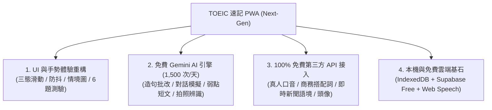

# 📋 TOEIC 速記 PWA：Next-Gen 完整功能與免費 API 規劃藍圖 (Master Roadmap)

本文件整合本專案之 **UI 互動體驗重構**、**免費 Gemini AI 殺手級功能** 與 **100% 免費第三方開放 API 接入矩陣**，全架構維持 **零伺服器維運費用（Zero-Cost）** 與 **自主掌控（Local-First）** 原則。

---

## 🗺️ 專案總體升級架構

---

## 🎴 一、UI 互動體驗與 6 題測驗重構

### 1. 卡片學習頁面 (`src/pages/FlashcardPage.tsx` & `SwipeableCard.tsx`)
- **三態滑動手勢**：👉 右滑（忘記 💥）、👆 上滑（不熟 🤔）、👈 左滑（掌握 💡），搭配動態紅/橘/綠微光反饋。
- **視窗防抖**：容器鎖定 `height: calc(100dvh - 130px)` 與 `overscroll-behavior: none`，卡片內部獨立捲動。
- **商務情境圖**：頂部展示 Unsplash 免版權商務圖片，載入失敗自動零版面偏移摺疊。
- **多情境例句 ＋ 朗讀**：展示 3~4 組商務例句，點擊英文呼叫 Web Speech API 真人發音。

### 2. 6 題立體測驗模組 (`src/pages/QuizPage.tsx`)
- 支援 **3 題選擇題 (MCQ)**（語意題、詞性文法題、同義換句話說）＋ **3 題克漏字 (Cloze)**（搭配詞、主動回憶、語境填空）。
- 答題後即時展開「多益考點解析與文法解析卡片」。
- 錯題「同字異題 (Variant)」自動排程機制。

---

## 🤖 二、免費 Gemini API 實作功能規劃 (每日 1,500 次免費額度)

| 功能模組 | 功能說明 | 實作方式 |
| :--- | :--- | :--- |
| **1. AI 商務造句批改與潤飾** | 學生自造句子 $\rightarrow$ 檢查文法打分，並改寫為 2 組高階商務 Email / 會議潤飾版本。 | 前端直接發送 JSON Schema Prompt，即時回傳批改結果。 |
| **2. 多益 Part 3/4 商務對話模擬** | 學生與 AI 進行 3 回合客戶/主管商務角色扮演（如確認交期、會議改期、談判協商）。 | 利用 Gemini Multi-turn Chat 模式對話。 |
| **3. 易混淆單字與多益陷阱拆解** | 「為什麼不是選 B？」$\rightarrow$ 自動對比兩混淆詞（如 `accommodate` vs `adapt`）之語意微差與考點。 | 結構化表格對比與常考誘答分析。 |
| **4. AI Vision：拍照辨識單字** | 學生拍下辦公室、機票、發票、合約照片 $\rightarrow$ 自動提取 3~5 個多益單字並出題。 | 傳送 base64 圖片予 Gemini Multimodal Vision 分析。 |
| **5. 弱點單字串聯：100 字商務 Email** | 挑選 5 個學生常錯單字 $\rightarrow$ 一鍵串成一篇 100 字高擬真商務 Email，在真實語境中記憶。 | 結合個人錯題本一鍵生成短文。 |
| **6. 多益 Part 7 動態閱讀測驗** | 根據近期複習單字，生成一篇短篇商務公告/信件並附 2 題閱讀理解測驗。 | 結構化產出短文與選擇題。 |

---

## 🌐 三、100% 免費第三方 API 接入矩陣 (Zero-Cost Public APIs)

以下 API 全數為 **永久免費、無須信用卡、無隱藏收費**，可直接由前端使用原生 `fetch()` 調用：

### 1. 🔊 免費音訊與真實發音 API
- **Free Dictionary API** (`https://api.dictionaryapi.dev/api/v2/entries/en/<word>`)：
  - **特色**：完全免費、免註冊、無速率限制。回傳美音與英音真人 MP3 檔案直連、音標 IPA 與詳細詞性。
- **Youdao 字典發音 CDN** (`https://dict.youdao.com/dictvoice?audio={word}&type=2`)：
  - **特色**：零延遲、免 API Key，直接作為 `<audio>` 標籤來源串流播放標準美音（type=2）或英音（type=1）。

### 2. 🔗 商務搭配詞與同義詞辭典 API
- **Datamuse API** (`https://api.datamuse.com/words`)：
  - **特色**：每日 100,000 次免費請求、免 API Key。
  - **應用**：
    - 查詢高頻商務搭配詞：`https://api.datamuse.com/words?rel_jja=budget` $\rightarrow$ 取得常用形容詞 `annual`, `tight`, `revised`。
    - 查詢商務同義詞：`https://api.datamuse.com/words?rel_syn=contract` $\rightarrow$ 取得 `agreement`, `compact`。

### 3. 🎨 個人化頭像與視覺生成 API
- **DiceBear SVG Avatars API** (`https://api.dicebear.com/9.x/avataaars/svg?seed={userName}`)：
  - **特色**：完全免費、開源、無限生成向量 SVG 頭像，根據學生名稱自動生成獨一無二的專屬卡通頭像。

### 4. 📰 每日商務名言與短句 API
- **Quotable API** (`https://api.quotable.io/quotes/random?tags=business|technology`)：
  - **特色**：完全免費，提供全球商業領袖、科技創辦人的經典商務名言，可用於每日首頁「商務英語名言推薦」。

### 5. 📱 瀏覽器原生免流量 Web APIs (零網路消耗)
- **Web Speech API (`SpeechRecognition`)**：支援麥克風語音輸入，學生可以開口唸英文，瀏覽器端本機辨識發音是否正確！
- **Web Share API (`navigator.share`)**：一鍵喚起手機原生分享選單，把今日學習成績或單字卡分享到 LINE 或社群。
- **App Badging API (`navigator.setAppBadge`)**：在手機桌面 PWA 圖示右上角顯示「今日待複習單字數量（如紅色 15）」，無需推播伺服器！
